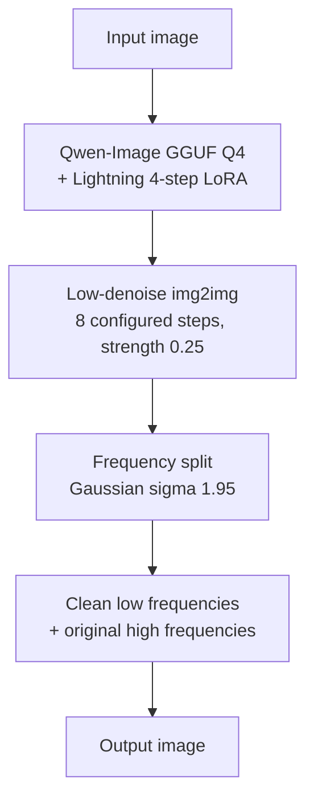

# DeSynth for macOS

An Apple Silicon adaptation of
[0xROOTPLS/DeSynth](https://github.com/0xROOTPLS/DeSynth). It uses a
low-denoise Qwen-Image img2img pass followed by frequency-domain detail
restoration. This fork replaces the CUDA-only installation with a native
PyTorch Metal (MPS) setup.

This project is intended solely for research, education, and authorized
evaluation. Do not use it to misrepresent the origin or provenance of content.

## macOS changes

- Uses native macOS PyTorch packages instead of CUDA 12.8 wheels.
- Automatically prefers Apple Metal (MPS) and enables CPU fallback for
  unsupported Metal operations.
- Sends sequentially offloaded pipeline modules to MPS explicitly.
- Includes the PEFT dependency required to load the Lightning LoRA.
- Pins Diffusers and Transformers to versions compatible with the loader
  patches used by this project.
- Accepts both `qwen-image-...` and `Qwen-Image-...` GGUF filename casing.
- Loads the bundled prompt embeddings with PyTorch's safer
  `weights_only=True` mode.
- Ignores large model files so they are not accidentally committed.

## Requirements

- Apple Silicon Mac (M1 or newer); Intel Macs are not supported.
- macOS 14 or newer.
- Python 3.12.
- At least 32 GB unified memory is recommended. The model may still be slow
  because sequential offload moves modules between system memory and MPS.
- About 18 GB of free disk space for the two external model files, Python
  packages, and the one-time Hugging Face cache.

## Install

Install Python 3.12 with Homebrew if it is not already available:

```bash
brew install python@3.12
```

Create an isolated environment and install the macOS dependencies:

```bash
cd /path/to/DeSynth-macos
/opt/homebrew/bin/python3.12 -m venv .venv
source .venv/bin/activate
python -m pip install --upgrade pip setuptools wheel
python -m pip install -r requirements.txt
```

Do not use the original project's CUDA requirements on macOS.

Verify that PyTorch can see the Apple GPU:

```bash
python -c 'import torch; print("torch:", torch.__version__); print("MPS:", torch.backends.mps.is_available())'
```

Continue only when the last line is `MPS: True`. The environment variable
`PYTORCH_ENABLE_MPS_FALLBACK=1` is set automatically by `desynth.py`.

## Model files

Model weights are intentionally not included. Download these two files into
the repository root:

| File | Approximate size | Source |
|---|---:|---|
| `qwen-image-2512-Q4_K_M.gguf` | 13 GB | [Frederic75/Qwen-Image-2512-GGUF](https://huggingface.co/Frederic75/Qwen-Image-2512-GGUF) |
| `Qwen-Image-2512-Lightning-4steps-V1.0-fp32.safetensors` | 1.6 GB | [lightx2v/Qwen-Image-2512-Lightning](https://huggingface.co/lightx2v/Qwen-Image-2512-Lightning) |

The small `embeds_cache.pt` prompt-embedding cache is included. On the first
run, Diffusers also downloads approximately 250 MB of Qwen-Image configuration
and VAE files from Hugging Face.

## Run

```bash
python desynth.py original.png
python desynth.py path/to/image.png
```

### Local Web UI (macOS)

For a graphical workflow, double-click `DeSynth Web UI.command` in Finder.
The first launch compiles a small native WebKit wrapper, then opens a local
window where you can select an image, tune the common options, run the pipeline,
compare the result, and reveal it in Finder.

The UI does not start an HTTP server, upload images, or add a web framework.
It talks to a persistent Python worker over local standard input/output, so the
large model stays loaded for subsequent runs while the window remains open.
Close the window or choose **Exit** to stop the worker and release the model.
The one-time wrapper build uses the Xcode Command Line Tools already present on
most developer Macs; it does not install any packages.

The command-line interface remains available for automation and advanced use.

The default device mode is `auto`. On an Apple Silicon Mac, startup should
include:

```text
accelerator: mps
```

To require MPS instead of silently falling back to CPU:

```bash
python desynth.py path/to/image.png --device mps
```

Output is written to:

```text
out/<name>_desynth_s8_d0.250_p1_r1.95.png
```

The seed is random unless `--seed` is supplied.

## How it works



The img2img stage changes the low-frequency image structure enough for the
project's watermark-removal hypothesis, but it also softens details. The
restore stage combines the processed image's low-frequency band with the
original image's high-frequency band.

The optional edge mode calculates a Sobel edge mask. It restores more original
detail near contours while retaining the safer Gaussian recipe in flatter
regions.

## Options

| Option | Default | Purpose |
|---|---:|---|
| `--device auto/mps/cpu/cuda` | `auto` | Select the execution accelerator |
| `--seed N` | random | Make a run reproducible |
| `--denoise X [X X]` | `0.25` | Run one or more denoise strengths |
| `--steps N` | `8` | Configured sampler step count |
| `--passes N` | `1` | Repeat the img2img pass |
| `--restore-sigma X` | `1.95` | Set the frequency restore cutoff |
| `--restore-mode gaussian/edge` | `gaussian` | Choose the restore recipe |
| `--unsharp X` | `0.0` | Apply post-restore sharpening |
| `--no-restore` | off | Save only the img2img result |
| `--keep-intermediate` | off | Also save the pre-restore image |
| `--transformer PATH` | bundled filename | Use another GGUF transformer |

## Quality comparison

```bash
python compare.py original.png out/<output>.png
```

`compare.py` reports PSNR, SSIM, low/high-frequency SSIM, MAE, MSE, and
per-channel histogram correlation. Add `--visual` to save a side-by-side
comparison image.

These metrics measure visual similarity only. They do not detect SynthID or
any other watermark. The upstream README's "not found" watermark verdicts
therefore require a separate detector that is not included in this repository.

## Upstream reported results

The following values are copied from the upstream NVIDIA-tested workflow and
have not yet been reproduced on macOS:

| Metric | Gaussian | Edge mode |
|---|---:|---:|
| PSNR | 32.47 dB | 31.47 dB |
| SSIM | 0.956 | 0.948 |
| SSIM, low frequency | 0.959 | 0.955 |
| SSIM, high frequency | 0.991 | 0.984 |
| MAE | 3.82 | 4.08 |

## Known limitations

- The macOS/MPS path has different performance characteristics from the
  upstream NVIDIA setup and may fall back to CPU for unsupported operations.
- CPU-only inference is allowed for diagnostics but is expected to be
  extremely slow and memory intensive.
- Lightning's four-step distillation causes most of the residual visual drift.
- The Diffusers GGUF loader is patched at runtime to reduce memory duplication;
  this depends on Diffusers internals, which is why the version is pinned.
- Watermark-removal effectiveness is not independently verified by the code in
  this repository.

## Files

| File | Role |
|---|---|
| `desynth.py` | macOS/MPS img2img and frequency-restore pipeline |
| `compare.py` | image-similarity metrics and optional visual comparison |
| `embeds_cache.pt` | cached prompt embeddings |
| `requirements.txt` | pinned Apple Silicon Python dependencies |

## Credits

The pipeline and original implementation come from
[0xROOTPLS/DeSynth](https://github.com/0xROOTPLS/DeSynth), which credits
[00quebec/Synthid-Bypass](https://github.com/00quebec/Synthid-Bypass) for the
baseline workflow and watermark hypothesis.
